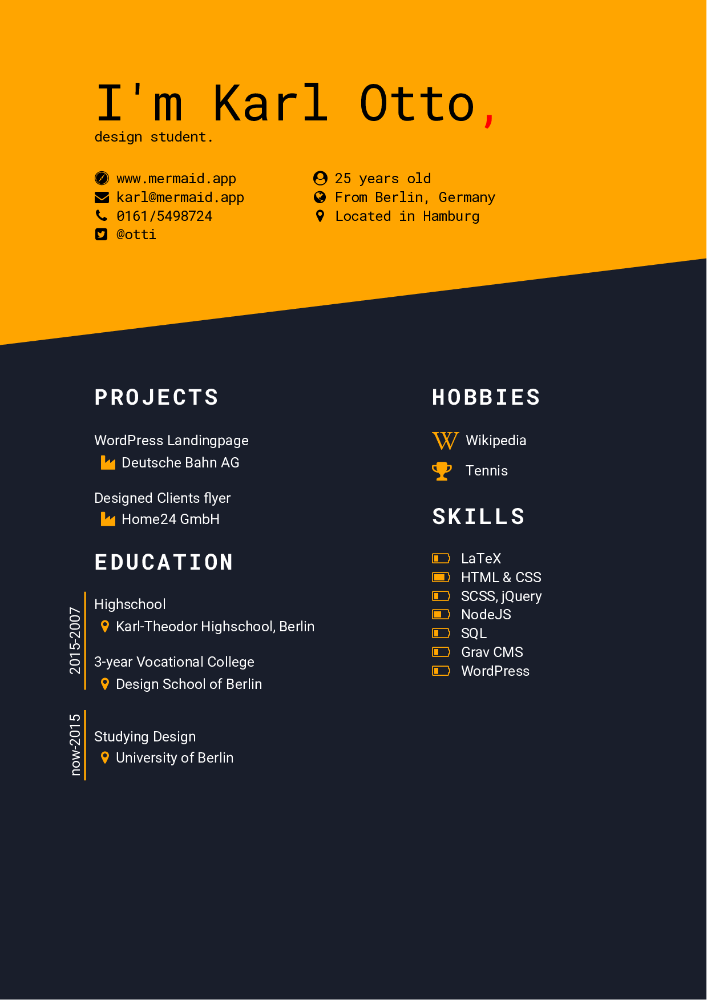

# README
## What's this?
This is an experiment using the new RelaxedJS.
I designed a curriculum vitae.



## Installation
You need [RelaxedJS](https://github.com/RelaxedJS/ReLaXed), nodeJS, npm.

```npm install relaxedjs```

Then run it in project folder, its watching the file.

```relaxed file.pug```

pug is a shorthand for HTML.

## Technologies
* FontAwesome
* Pug
* SCSS

That's it.
